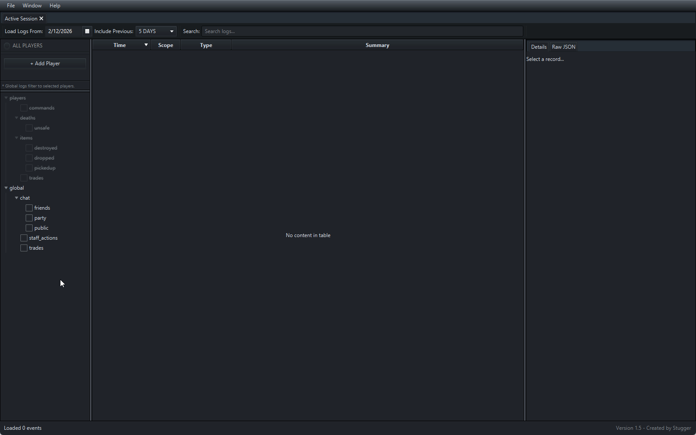

# JSON Log Viewer

A standalone JavaFX log viewer for structured JSONL (one-JSON-object-per-line) logs.

Originally designed for online-game style logs, but flexible enough for any structured JSONL logging system.



---

## ✨ Version 1.5

V1.5 introduces a fully YAML-driven schema system.

Log summaries and detail panels are now rendered using external schema definitions.  
No recompilation is required to:

- Add new log types
- Modify summary formatting
- Change how details are displayed
- Adjust rendering styles for complex fields

Schemas can be edited independently from the application.

---

## Features

- JSONL streaming (low memory overhead)
- Player + Global scopes
- Tree-based log type filtering
- Time range filtering
- Multi-player filtering (auditing)
- Search across summaries and raw JSON
- Dark mode UI
- YAML schema-driven summaries & details
- Structured details panel rendering
- Multiple render modes for complex JSON values
- Expression engine with:
  - Field access
  - Array indexing
  - Array size (`.length`)
  - Formatting (`:raw`)
  - Coalesce (`||`)
  - Optional blocks (`[[ ... ]]`)
  - Optional fallback (`[[ TRY ||| ELSE ]]`)

---

## Log Format

- One JSON object per line (JSONL)
- Files grouped by day
- Folder structure:
  - `players/<username>/<type>/<day>.jsonl`
  - `global/<type>/<day>.jsonl`
- Each log entry must include:
  ```json
  {
  "timeMs": 1700000000000,
  "schemaId": "chat.public"
  }
  ```

- Required fields:
  - **timeMs** → Used for filtering and sorting
  - **schemaId** → Used to resolve the YAML schema

---

## Schema System

Schemas are written in **YAML**.

Default schema directory:

```
~/.log_viewer/schemas/
```

This directory can be changed in `File → Settings` and schemas can be hot-reloaded from `File → Reload Schemas`

---

### Example Schema
`/schemas/chat.yml`
```yaml
schemas:
  - schemaId: chat.public
    displayName: Public chat message
    summary: "[${tile.x}, ${tile.y}, ${tile.p}] ${user}: ${msg}"
    details:
      - { label: User, path: user }
      - { label: Message, path: msg }
      - { label: Tile, path: tile }
```

---

### Summary Template Engine

The summary field supports a lightweight expression language.

#### Field Access
```
${user}
${tile.x}
${users[0]}
```

#### Array Length
```
${users.length}
```

#### Coalesce (||)

Returns the first non-empty value:
```
${users[0] || npc}
```

#### Optional Blocks ([[ ... ]])

Renders only if at least one expression inside produces a value:
```
killed by [[${users[0] || npc}]]
```

#### Optional Fallback ([[ TRY ||| ELSE ]])

- Provides a fallback value if the tried expression does **not** produce a value
- Both sides support expressions
- Block will not render if neither side produces a value

```
[[killed by ${users[0] || npc}|||suicide]]
```

#### Number Formatting

- Large integers automatically formatted with commas
- Use `:raw` to disable formatting
```
${value}
${value:raw}
```

---

### Detail Field Missing Values

Schema detail fields can control how missing values are handled in the Details panel.

#### Behavior:

`optional: false` (default) → Field value is shown as `—` (em dash) if missing.

`optional: true` → Field is excluded entirely if missing.

#### Example:

If only one of the two following fields can produce a result, then only the field that produces the result will render.

```yaml
- { label: Player Killer, path: "users[0]", optional: true }
- { label: NPC Killer, path: npc, optional: true }
```

#### Special rule for numbers:

If `optional: true` and the value is `0` → The field is excluded (treated as missing).

---

### Detail Field Rendering Modes

Schema detail fields can control how complex JSON values are rendered in the Details panel.

#### Available render modes:

| Mode            | Description                              |
|:----------------|:-----------------------------------------|
| compact         | YAML(ish)-style multi-line (**default**) |
| inline_compact  | YAML(ish)-style single-line              |
| json            | Pretty JSON                              |
| inline_json     | Compact JSON                             |

#### Example:
```yaml
- { label: Items, path: items, render: inline_compact }
```

---

# 🚀 Quick Start Guide (5 Minutes)

#### Requires:
- Java 21+

You can run the viewer immediately using the included sample logs and schemas.

---

### 1️⃣ Clone the repository
`git clone <repo-url>`

`cd json-log-viewer`

---

### 2️⃣ Build & Run

- Build: `./gradlew build`
- Run: `./gradlew run`

---

### 3️⃣ Install Sample Schemas

On first launch, the application will create a `.log_viewer/` directory in your user home folder.

In your file explorer:

1. Navigate to the provided `sample_schemas/` directory in this repo
2. Copy the `.yml` schema files
3. Navigate to: `~/.log_viewer/schemas/`
4. Paste the schema files

In the app:

- Go to **File → Reload Schemas**

(use this any time when modifying schemas to see changes live)

---

### 4️⃣ Load Sample Logs

In the app:

1. Go to **File → Choose Logs Root**
2. Select the provided `sample_logs/` directory
3. Open **File → New Tab**
4. Set **Load Logs From** to the date matching the sample logs

Then:

- Use the folder tree to select which log types to load
- Select **ALL PLAYERS** to include player logs
- Or add individual players to audit specific accounts

---

### 📂 Sample Log Structure

```
sample_logs/
├─ global/
│  ├─ chat/public/
│  │  └─ 2026_02_13.jsonl
│  └─ trades/
│     └─ 2026_02_13.jsonl
├─ players/
│  ├─ jake/trades/
│  │  └─ 2026_02_13.jsonl
│  └─ stugger/trades/
│     └─ 2026_02_13.jsonl
```

Each file contains one JSON object per line:

```json
{"tile":{"x":100,"y":200,"p":0},"msg":"hello world","user":"jake","timeMs": 1771009667714,"schemaId":"chat.public"}
```

---

## Status

**V1.5 complete.**

Schema system is fully functional and stable.

#### Future improvements may include:
- Arithmetic expressions
- Extended conditionals
- In-app schema documentation panel
- In-app schema editor
- Export tools