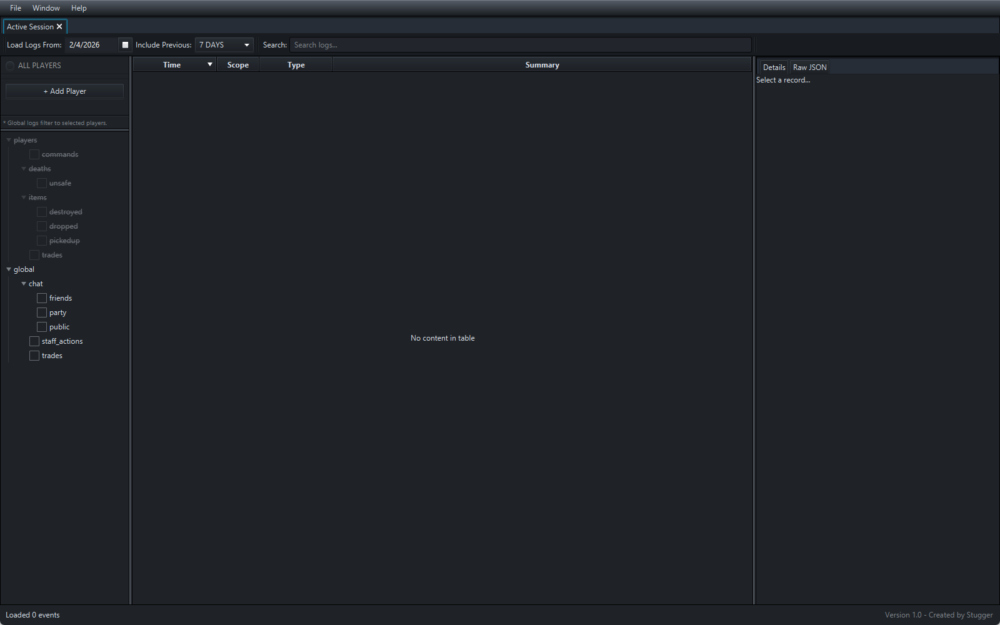
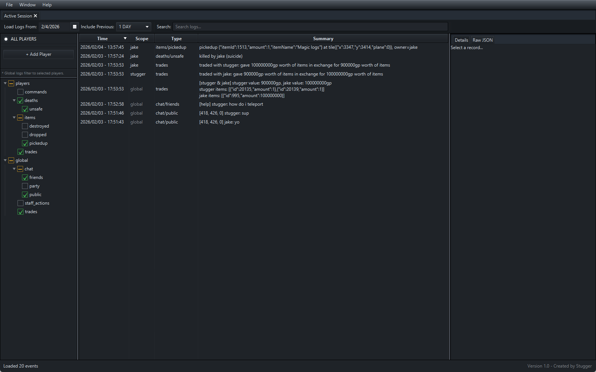

# JSON Log Viewer (V1)

A standalone JavaFX log viewer for online-game-style JSONL logs.
Designed for large datasets, per-day files, and selective loading
by scope, player, and log type.

## Features
- JSONL streaming (low memory overhead)
- Player + global scopes
- Tree-based log type filtering
- Time range filtering
- Search across summaries and raw JSON
- Dark-mode UI

## Log Format
- One JSON object per line (JSONL)
- Files grouped by day
- Folder structure:
  players/<username>/<type>/<day>.jsonl
  global/<type>/<day>.jsonl

## Status
V1 complete. Schema-based rendering and performance optimizations planned.

## Running
- Requires Java 21+
- Build: ./gradlew build
- Run: ./gradlew run

## Screenshots
